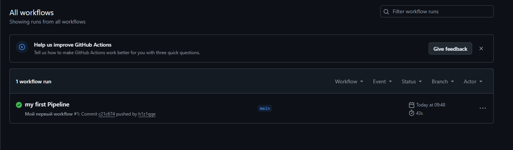

# Первый Pipeline на CI в GitHub Actions

[](https://github.com/h1z1qqe/my-first-cicd/actions/workflows/hello.yml)

---

## Цель работы

**Цель** — заставить систему **GitHub Actions** работать и успешно выполнить первый CI-пайплайн.

---

## Выполнение работы

### 1. Создание репозитория и структуры проекта

На **GitHub** был создан новый публичный репозиторий `my-first-cicd` с файлом `README.md`.

Для работы над проектом я использовал **GitHub Codespaces** — облачную среду разработки, которая позволяет писать код и выполнять команды прямо в браузере, без необходимости устанавливать что-либо на локальный компьютер. Все дальнейшие действия выполнялись в терминале Codespaces.

В корне репозитория я создал папку `.github/workflows/` для хранения файлов workflow. Для этого выполнил команду:

```shell
mkdir -p .github/workflows && touch .github/workflows/hello.yml
```

### 2. Создание файла `hello.yml`

Внутри папки `.github/workflows/` был создан файл `hello.yml` со следующим содержимым:

```yml
name: Мой первый workflow
on: [push] # Запускать при каждом пуше
jobs:
  build:
    runs-on: ubuntu-latest # Использовать последнюю версию Ubuntu
    steps:
      - uses: actions/checkout@v4 # Шаг 1: скачать код из репозитория
      - name: Запустить команду
        run: echo "Привет, мир! Я только что запустил CI!"
```

**Разбор конфигурации:**
- `name` — имя workflow, которое будет отображаться на вкладке Actions.
- `on: [push]` — workflow будет автоматически запускаться при каждом пуше в любой branch.
- `jobs.build` — определяет одно задание с именем `build`.
- `runs-on: ubuntu-latest` — задание выполняется на виртуальной машине с последней версией Ubuntu.
- `steps` — список шагов, которые выполняются последовательно:
  - `actions/checkout@v4` — скачивает код репозитория в рабочую директорию.
  - `run: echo "..."` — выводит приветственное сообщение в лог.

### 3. Коммит и пуш изменений

Я добавил созданные файлы в индекс Git, сделал коммит и запушил изменения в ветку `main`:

```shell
git add .
git commit -m "Добавлен первый workflow для GitHub Actions"
git push origin main
```

### 4. Проверка выполнения в GitHub Actions

После пуша я перешёл на вкладку **Actions** в репозитории на **GitHub**. Там отобразился запущенный workflow.

Через несколько минут выполнение завершилось успешно — загорелась **зелёная галочка**, что означает, что все шаги прошли без ошибок.



---

## Использованные инструменты

- **GitHub** — платформа для хостинга репозиториев.
- **GitHub Codespaces** — облачная среда разработки.
- **GitHub Actions** — система CI/CD для автоматизации сборки, тестирования и развёртывания.
- **YAML** — язык разметки для конфигурационных файлов.
- **Markdown** — язык разметки для оформления документации.

---

## Заключение

В ходе работы я успешно настроил первый CI-пайплайн с помощью GitHub Actions. Workflow автоматически запускается при каждом пуше, выполняет checkout кода и выводит приветственное сообщение. Это базовый, но важный шаг к пониманию принципов непрерывной интеграции и автоматизации процессов разработки.
